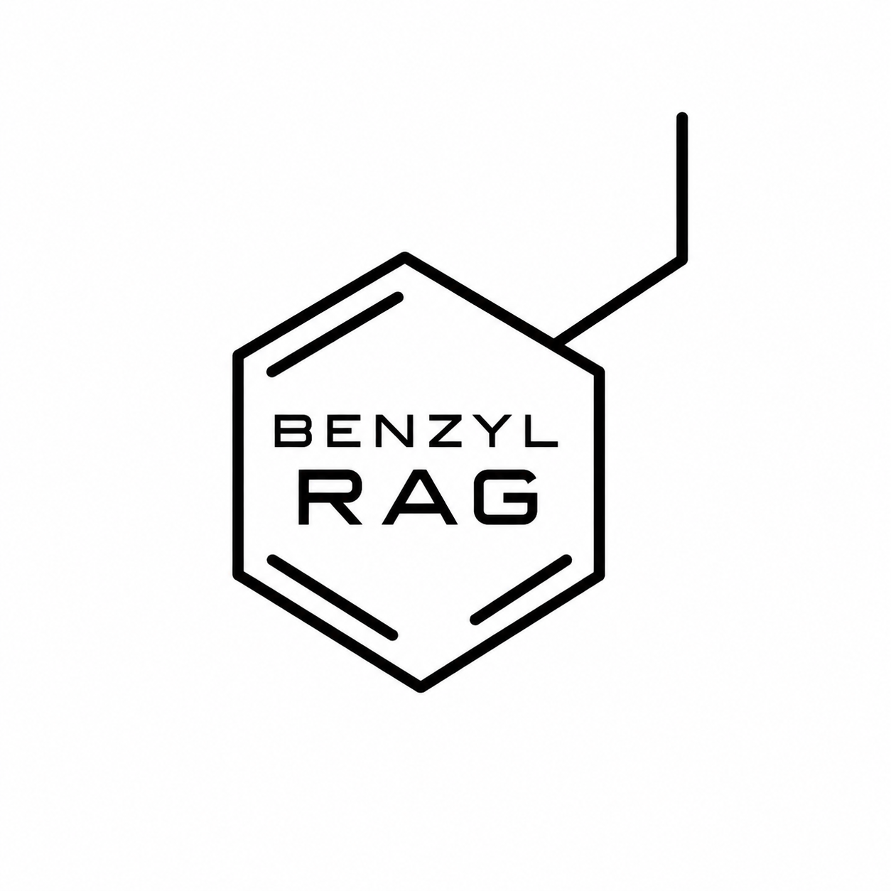
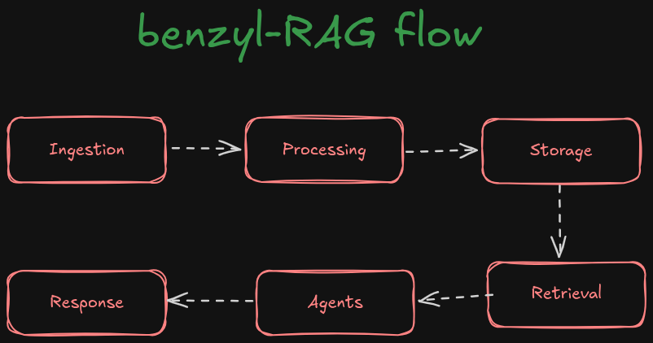
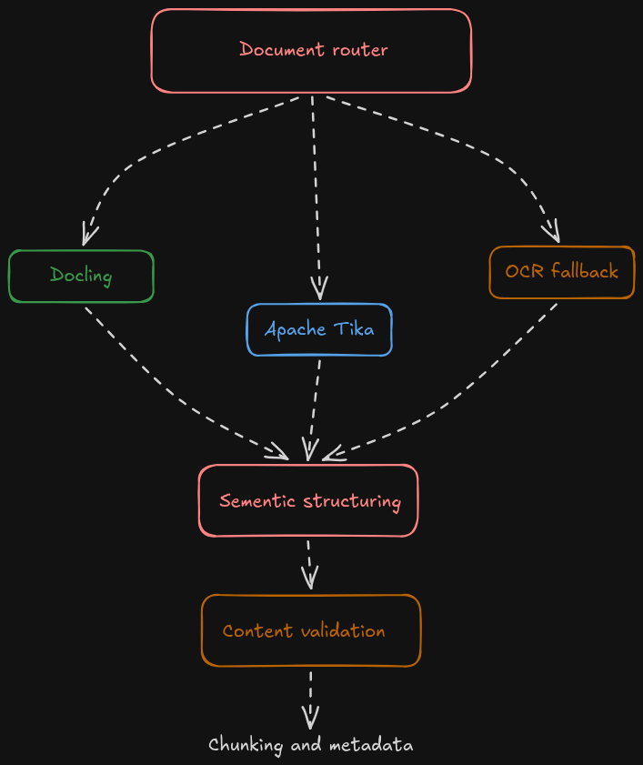
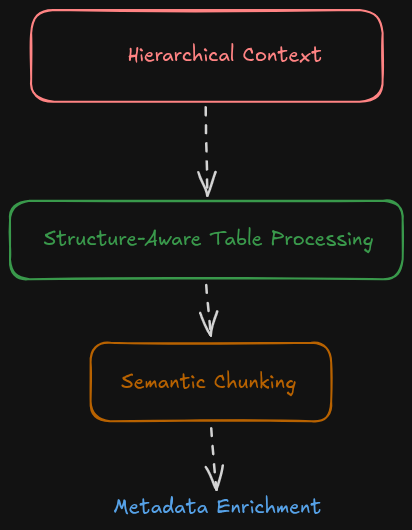
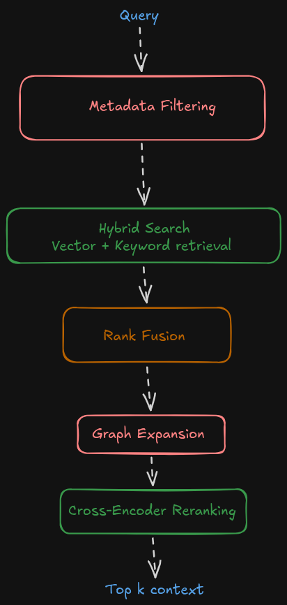
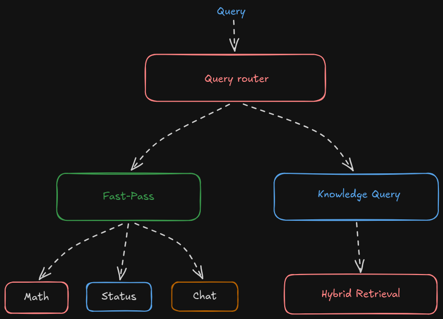
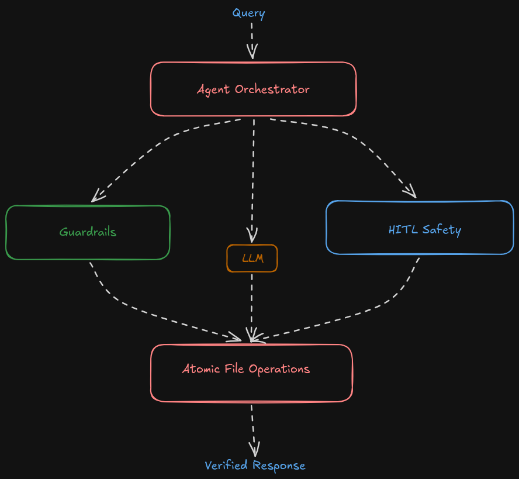
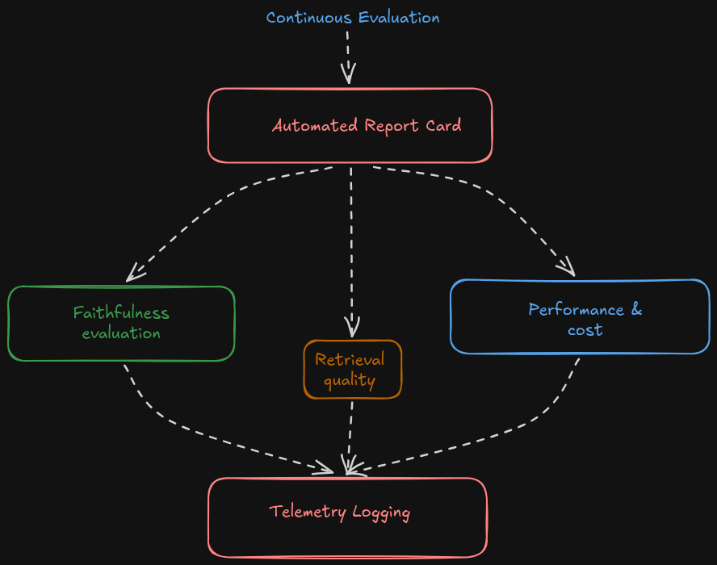

<p align="center">
  
</p>

# benzyl-RAG

[](https://www.python.org/downloads/)
[](LICENSE)
[](https://ollama.com/)
[](https://qdrant.tech/)
[](https://hub.docker.com/r/tastytaco/benzyl-rag)

**The missing bond between you and your documents**

Benzyl RAG is a local-first AI assistant that understands your document collection, retrieves the right context, and delivers reliable answers with citations-without sending your data to the cloud.

<p align="center">
  
  <br>
  For a complete end-to-end walkthrough of the pipeline, see <a href="./flow.md" target="_blank">flow.md</a>.
</p>

<details>
<summary><b>1. Ingestion & Parsing</b></summary>

<br>



- **Structured Layout Parsing via `Docling`**
  - Uses [**Docling**](https://github.com/docling-project/docling) integrated with [**Unstructured**](https://github.com/Unstructured-IO). Standard PDF text extractors flatten documents and lose visual hierarchy; Docling parses multi-column layouts, section headings, and complex tables into structured hierarchical Markdown so downstream chunkers preserve document structure.
- **Multi-Format Ingestion using `Apache Tika`**
  - [**Apache Tika**](https://tika.apache.org/) (tika-python), along with Unstructured, automatically detects document formats and extracts content across diverse non-PDF formats like .docx, .xlsx, .html, .txt, .epub, etc. without needing format-specific parsers.
- **PDF OCR Fallback using (`pdf2image`, `pytesseract`, `poppler-utils`)**:
  - [**pdf2image**](https://github.com/Belval/pdf2image), backed by system [poppler-utils](https://github.com/elswork/poppler-utils), [pytesseract](https://github.com/tesseract-ocr/tesseract), and [pypdf](https://github.com/py-pdf/pypdf). When layout extraction fails on image-only or scanned PDFs (e.g., scanned ID cards lacking a text layer), the pipeline automatically falls back to OCR for scanned or image-only PDFs.
- **Garbage-Text Safety Gate**:
  - Custom heuristic entropy and object-stream byte validator that blocks corrupted binary font streams or unreadable PDF object streams from contaminating the vector index, logging concrete exception traces (logger.error) instead of polluting embeddings with noise.

<br clear="both"/>
</details>

<details>
<summary><b>2. Intelligent Chunking & Metadata Enrichment</b></summary>

<br>



- **Hierarchical Heading Breadcrumbs `MarkdownHeaderTextSplitter`**:
  - Standard fixed-size chunking splits paragraphs arbitrarily and breaks semantic context. Tracking the active header lineage and prefixing explicit `[Heading Context: ...]` prefixes ensures vector embeddings retain parent section context.
- **Atomic & Massive Table Preservation**:
  - Table detection and header-aware row splitter; splitting tables across rows breaks tabular relationships. Tables $\le 4,000$ characters are preserved intact as atomic units (`metadata["is_table"] = True`), while massive tables ($> 4,000$ characters) are split row-by-row, with column headers explicitly prefixed to every chunk.
- **Metadata Pre-Computation**:
  - Local Stop-Word-Filtered Term Frequency (TF) unigram keyword extraction and heuristic summary / QA generator. Precomputing summaries, domain keywords, and hypothetical questions at index time enables deterministic metadata filtering and improves dense retrieval recall without runtime LLM latency.

<br clear="both"/>
</details>

<details>
<summary><b>3. Database Storage & Hybrid Retrieval</b></summary>

<br>



- **Metadata & Payload Pre-Filtering**:
  - Qdrant deterministic payload filters allow queries to instantly filter candidates by folder path, document type, or structural flags prior to vector similarity traversal.
- **Dense Semantic Vector Search (`Qdrant` + `BAAI/bge-m3`)**:
  - Embedded local [**Qdrant**](https://github.com/qdrant/qdrant) Vector DB with **1024-dimensional** embeddings from [**`BAAI/bge-m3`**](https://huggingface.co/BAAI/bge-m3), capturing deep semantic and conceptual similarity across multilingual and domain-specific text, where exact terminology differs from the user's queries.
- **Sparse Exact Keyword Matching (`Rank-BM25`)**:
  - Inverted [BM25](https://www.elastic.co/blog/practical-bm25-part-2-the-bm25-algorithm-and-its-variables) token index. Complements dense vector search by retrieving exact lexical matches that semantic embeddings may miss.
- **Reciprocal Rank Fusion (RRF) & Bayesian Feedback Priors**:
  - RRF algorithm ($k_{rrf}=60$) combined with time-decayed Bayesian user feedback. Normalizes unbounded BM25 scores and $[0, 1]$ cosine scores into a single ranking, while safely boosting historically helpful chunks without vulnerability to feedback manipulation ($M \ge 2$ vote gate).
- **Graph Context Expansion**:
  - Directed adjacency graph traverses structural 1-hop and 2-hop edges around top hits to discover structurally linked context.
- **Cross-Encoder Reranking**:
  - HuggingFace Cross-Encoder model (`BAAI/bge-reranker-v2-m3`). Rescores broad candidate pools by jointly attending over query-document pairs, filtering out semantic false positives to return the top **k** highest-precision chunks.

<br clear="both"/>
</details>

<details>
<summary><b>4. Orchestration & Fast-Pass Query Routing</b></summary>

<br>



- **Semantic Query Router**:
  - Lightweight AST heuristic classification rules which prevent unnecessary latency and resource usage by intercepting deterministic queries before touching the database or LLM:
    - **`DIRECT_MATH`**: Evaluates arithmetic ASTs (e.g., `145 * 23 + sqrt(144)`) safely via sandboxed Python AST traversal.
    - **`DIRECT_STATUS`**: Answers system queries such as `"How many documents are indexed?"` instantly from cached telemetry counters.
    - **`DIRECT_CONVERSATIONAL`**: Handles greetings instantly without database lookups.

<br clear="both"/>
</details>

<details>
<summary><b>5. Multi-Agent Execution & Safety</b></summary>

<br>



- **Orchestration Engine**: Modular multi-agent engine. Decouples monolithic RAG scripts into specialized single-responsibility agents executing a deterministic pipeline.
- **Adversarial Guardrails & Secure Prompt Framing**: Near-duplicate clustering (`Jaccard >= 0.82`), Z-score outlier quarantine ($z > 2.0\sigma$), Graph-Expansion Gate (`sim >= 0.25`), Unicode NFKC sanitization, and explicit `<<< UNTRUSTED_DATA_BLOCK >>>` framing. Protects against OWASP LLM Top 10 threats including Corpus Poisoning (adversaries flooding retrieval pools with duplicates) and Indirect Prompt Injection (hidden instructions inside documents).
- **Local LLM Synthesis (`Ollama` + `qwen3:8b`)**: Local Ollama daemon running `qwen3:8b` (configurable in `config.py`). Keeps data local-first-user documents and queries never leave the local machine.
- **Atomic Filesystem Operations & HITL Safety Gate**:
  - Atomic file writing and a persistent serialized state machine: any file write (`SAVE`/`APPEND`) or `DELETE` creates a `HITLApprovalRequest` in `PENDING` state and blocks execution until explicitly approved (`approve_action`), preventing unauthorized mutations or filesystem corruption.

<br clear="both"/>
</details>

<details>
<summary><b>6. Evaluation & Continuous Observability</b></summary>

<br>



- **Report Card**: Automated continuous evaluator. Grades every interaction synchronously across:
  - **Faithfulness ($S_{\text{faith}}$)**: N-gram Jaccard entailment verifying that generated assertions are grounded in retrieved context (flags hallucinations if $< 0.40$).
  - **Context Relevance ($S_{\text{relevance}}$)**: Sigmoid-normalized Cross-Encoder logit scores measuring retrieval precision.
  - **Answer Relevance ($S_{\text{answer-rel}}$)**: Query-to-answer lexical overlap alongside latency and cost metrics.
- **Decoupled Telemetry Cost Modeling**:
  - Asynchronous evaluation logging records evaluation metrics in the background while estimating equivalent cloud inference costs to benchmark local savings.

<br clear="both"/>
</details>

## Project Structure

```text
benzyl-RAG/
├── app/                  # Core application, retrieval engine, and agent orchestration
│   └── agents/           # Multi-agent workflows and HITL logic
├── data/                 # Your documents (PDFs, DOCX, XLSX, HTML, Markdown, TXT, ...)
├── .data/                # Vector database, indexes, and evaluation data
├── .mission_state/       # Pending human approval state
├── indexing/             # Document ingestion and indexing pipeline
├── guardrails/           # Safety, validation, and security checks
├── scripts/              # Utility and automation scripts
└── main.py               # CLI entry point
```

## Agent Reference

Benzyl RAG uses specialized agents to handle different tasks automatically. Most work behind the scenes, while some respond directly to your requests.

| Agent          | Role                                                                             | Example                                               |
| -------------- | -------------------------------------------------------------------------------- | ----------------------------------------------------- |
| **Planner**    | Breaks complex questions into smaller retrieval tasks.                           | _"Compare the architectures of GFS and HDFS."_        |
| **Researcher** | Finds the most relevant information from your documents.                         | _"What are the main contributions of the GFS paper?"_ |
| **Synthesis**  | Combines retrieved context into a clear, cited answer.                           | _"Summarize the blockchain consensus section."_       |
| **File**       | Creates, updates, or deletes files with confirmation before changes are applied. | _"Save this summary as `gfs_summary.md`."_            |
| **Math**       | Solves mathematical expressions without using an LLM.                            | _"Calculate `(145 × 23) + √144`."_                    |
| **Status**     | Reports information about the current knowledge base and system.                 | _"How many documents are indexed?"_                   |

> **Safety:** Any request that modifies files requires your approval before changes are applied (**HITL**: Human-In-The-Loop).

## Setup & Usage

### Getting the Code

Clone the repository to your local machine:

```bash
git clone https://github.com/Kaushikmak/benzyl-RAG.git
cd benzyl-RAG
```

To update an existing installation to the latest version at any time:

```bash
git pull origin main
```

---

### Option A: Docker & Containerization (Recommended)

Benzyl RAG runs as a fully self-contained multi-container stack (**Qdrant Vector DB**, **Ollama LLM Server**, and the **Benzyl RAG Multi-Agent Engine**). You do **not** need to install or run Ollama separately on your host machine—Docker automatically downloads and manages the default **`qwen3:8b`** model inside a persistent container volume.

#### 1. Launching Containers (Self-Contained Automated Setup)

The easiest way to get started immediately from your local checkout is to run the automated setup script or Docker Compose build:

- **macOS (Intel & Apple Silicon M1–M4) & Linux**:
  ```bash
  # Automated one-step setup (creates directories, builds containers, starts Ollama & Qdrant)
  chmod +x setup.sh && ./setup.sh

  # Or manually build and launch containers
  docker compose up -d --build
  ```

- **Windows (PowerShell or Command Prompt)**:
  ```powershell
  # Launch self-contained Qdrant + Ollama + RAG containers
  docker compose up -d --build
  ```

> [!NOTE]
> **Automated Ollama Model Download**: Upon startup, the `ollama-init` service automatically pulls **`qwen3:8b`** into `./data/ollama_storage`. This only happens once; subsequent restarts reuse the downloaded model volume.

#### 2. Pulling Pre-built Docker Images (Optional)

Official multi-architecture images (`linux/amd64` and `linux/arm64`) are published to Docker Hub and GitHub Container Registry whenever a official release tag (`v*`) is released:

```bash
# Pull from Docker Hub
docker pull tastytaco/benzyl-rag:latest

# Or pull from GitHub Container Registry
docker pull ghcr.io/kaushikmak/benzyl-rag:latest
```

#### 4. Indexing & Querying Inside Docker

Once containers are running (`docker compose ps`), place your document files (`.pdf`, `.docx`, `.xlsx`, `.md`, etc.) into the `./data/` folder and execute:

```bash
# 1. Index documents into the vector database
docker compose exec -it rag-app python main.py index

# 2. Start the interactive multi-agent CLI assistant
docker compose exec -it rag-app python main.py cli

# 3. Or run a one-shot non-interactive query
docker compose exec -it rag-app python main.py query -q "Summarize the key findings in the documents."
```

---

### Option B: Local Python Environment (Native Installation)

If you prefer running Benzyl RAG directly on your machine without Docker, follow these OS-specific steps.

#### 1. System Prerequisites

The ingestion pipeline requires `tesseract-ocr` and `poppler-utils` for OCR and image-only PDF layout parsing.

- **macOS (Intel & Apple Silicon)**:
  Install system packages using [Homebrew](https://brew.sh/):
  ```bash
  brew install tesseract poppler python@3.11
  ```

- **Linux (Ubuntu / Debian / Linux Mint)**:
  Install system packages using `apt`:
  ```bash
  sudo apt update && sudo apt install -y \
      tesseract-ocr \
      poppler-utils \
      python3-venv \
      python3-pip \
      build-essential
  ```

- **Windows (10/11)**:
  - **WSL2 Ubuntu (Recommended)**: Follow the Linux (Ubuntu/Debian) instructions above inside your WSL2 terminal.
  - **Native Windows**:
    1. Install Python 3.10 or 3.11 from [python.org](https://www.python.org/downloads/).
    2. Install [Tesseract OCR for Windows](https://github.com/UB-Mannheim/tesseract/wiki) and add `C:\Program Files\Tesseract-OCR` to your system `PATH`.
    3. Download [Poppler for Windows](https://github.com/oschwartz10612/poppler-windows) binaries and add its `Library\bin` directory to your system `PATH`.

#### 2. Create & Activate a Virtual Environment

After cloning/pulling the repository (`git pull origin main`), set up your Python environment:

- **macOS & Linux**:
  ```bash
  python3 -m venv .venv
  source .venv/bin/activate
  ```

- **Windows (PowerShell)**:
  ```powershell
  python -m venv .venv
  .\.venv\Scripts\Activate.ps1
  ```

#### 3. Install Python Dependencies

```bash
pip install --upgrade pip
pip install -r requirements.txt
```

#### 4. Configure & Start Ollama

Ensure [Ollama](https://ollama.com/) is running locally and pull the default model:

```bash
ollama pull qwen3:8b
```

#### 5. Index Your Documents Locally

Place your documents inside `./data/` and index them:

```bash
python main.py index
```

*(Re-running `python main.py index` cleanly recreates the local vector collections to prevent duplicate chunks).*

#### 6. Run the Application

```bash
# Interactive CLI Chat
python main.py cli

# Or execute one-shot queries
python main.py query -q "Explain the main architectural decisions."

# On macOS/Linux, you can also use the unified pipeline runner:
./scripts/run_pipeline.sh cli
```

## Configuration Details

All major settings are located in `app/config.py`:

- `OLLAMA_MODEL`: The canonical local LLM to use (default: `qwen3:8b`; alternates such as `llama3` work seamlessly).
- `EMBED_MODEL`: The HuggingFace embedding model (default: `BAAI/bge-m3`).
- `RERANK_MODEL`: The cross-encoder used for reranking (default: `BAAI/bge-reranker-v2-m3`).
- Chunking limits, vector store paths, and device settings (`cuda` vs `cpu`) can also be toggled here.

## Guardrails

Benzyl RAG includes a modular guardrails pipeline that protects the retrieval process from malicious or manipulated content. It is designed to improve answer reliability while remaining compatible with different retrieval strategies.

The pipeline focuses on defending against two common threats:

- **Corpus Poisoning** – Detects duplicate, anomalous, or manipulated documents that could bias retrieval.
- **Indirect Prompt Injection** – Identifies and neutralizes malicious instructions embedded inside retrieved documents before they reach the language model.

```text
guardrails/
├── core/                  # Shared interfaces and pipeline components
├── redteaming/            # Attack payload generators
├── defenses/
│   ├── detection/         # Duplicate and anomaly detection
│   ├── filtering/         # Prompt sanitization and content filtering
│   └── isolation/         # Partition-and-aggregate defense
├── evaluation/            # Benchmarking and attack evaluation
└── pipeline.py            # Guardrails pipeline
```

### Evaluation

Guardrails are evaluated using a dedicated benchmarking framework that measures:

- Attack Success Rate (ASR)
- Retrieval quality
- Response latency
- Safety improvements

Evaluation is performed in an isolated clone of the knowledge base, ensuring production data remains unchanged during testing.

### Limitations

Guardrails reduce the impact of document poisoning and prompt injection but cannot eliminate every possible attack. Sophisticated adversarial content may still evade heuristic detection, making layered defenses and continuous evaluation essential.
