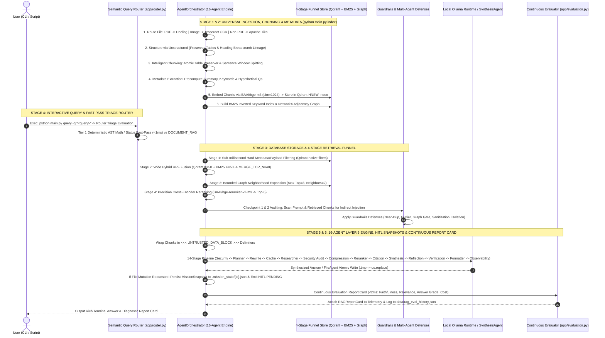

# benzyl-RAG End-to-End System Flow (`flow.md`)

> *A complete chronological execution trace detailing Universal Ingestion & Parsing, Intelligent Chunking & Metadata, 4-Stage Hybrid Retrieval Funnel, Fast-Pass Query Routing, Multi-Agent Guardrails & HITL Safety Gating, and Continuous Evaluation Report Card Telemetry.*

---

## 1. Complete End-to-End Execution Flowchart



---

## 2. Phase 1: Universal Document Ingestion, Chunking & Multi-Index Construction

Before any query can be answered, the system executes `python main.py index` to process documents inside `data/` (`.pdf`, `.docx`, `.xlsx`, `.html`, `.md`, `.txt`, etc.), storing all internal databases and logs in `.data/`.

### Step 1.1: Universal Ingestion, Intelligent Chunking & Metadata Enrichment
1. **Universal External File Routing & Multi-Tier PDF Fallback**:
   - **PDF Documents (`.pdf` / `application/pdf`)**:
     1. **Primary Structured Parsing**: Routed to **Docling (`DocumentConverter`)** for layout-aware table and heading extraction into hierarchical Markdown, fed into **Unstructured (`partition_md`)**.
     2. **Image-Only PDF Rasterization & OCR Fallback (`_ocr_pdf_via_pdf2image`)**: If standard high-resolution extraction fails (e.g., image-only scanned PDFs like `VNIT college ID.pdf` lacking a text layer), the pipeline rasterizes each page to images using **`pdf2image`** (requiring system `poppler-utils`) and performs direct OCR via **`pytesseract`** (`/usr/bin/tesseract`).
     3. **Text-Layer Fallback (`pypdf`)**: Tried if rasterized OCR is not required or fails.
     4. **Garbage-Text Safety Gate (`_is_garbage_text`)**: Blocks unreadable object-stream raw binary bytes from ever being accepted as fallback text across both PDF and non-PDF paths.
     5. **Explicit Error Telemetry**: All parser or dependency failures are logged via `logger.error` with concrete exception types and trace messages instead of silent warnings.
   - **Non-PDF Documents (`.docx`, `.xlsx`, `.html`, `.txt`, `.epub`, etc.)**: Routed to **Apache Tika (`tika-python`)** for universal format parsing and rich metadata extraction, followed by **Unstructured (`partition`)** for semantic heading and table structuring, guarded by the same garbage-text gate.
2. **YAML Frontmatter & Metadata Extraction**: Strips frontmatter from notes while recording document provenance (`parser_pipeline`, `mime_type`, author, creation timestamps).
3. **Intelligent Chunking Engine (`indexing/chunking.py`)**:
   - **Heading Stack & Context Prefixing**: Tracks Markdown headers (`#` to `######`) as a stack (`Architecture > Databases > PGVector`), saving the lineage in `metadata["heading_breadcrumb"]` and prefixing `[Heading Context: ...]\n\n` to every chunk before embedding.
   - **Atomic & Massive Table Handler**: Small tables ($\le 4,000$ chars) are preserved as indivisible atomic units (`metadata["is_table"] = True`). Massive tables ($> 4,000$ chars) are split row-by-row while prepending column header rows to each split sub-chunk.
   - **Sentence Window Splitting**: Narrative text is split at paragraph and sentence boundaries up to `chunk_size=600`, `chunk_overlap=100`.
4. **Metadata Extraction (`extract_chunk_metadata`)**:
   - Precomputes `summary`, stop-word-filtered domain `keywords` (via RAKE/TF-IDF), and `hypothetical_questions` for every chunk.

### Step 1.2: Dense Vector Embedding & Space Mapping (`Qdrant`)
1. **Embedding Generation**: Each text chunk is fed into `BAAI/bge-m3`, a dense multilingual embedding transformer producing a $d=1024$ dimensional vector $\mathbf{v}_i \in \mathbb{R}^{1024}$.
2. **Unit Sphere Normalization**: Vectors are $\ell_2$-normalized ($\|\mathbf{v}_i\|_2 = 1$), allowing cosine similarity to be computed purely as dot products ($\langle \mathbf{v}_A, \mathbf{v}_B \rangle$).
3. **HNSW Graph Indexing**: Vectors are inserted into an embedded local **Qdrant** database (`./data/qdrant_db`) using Hierarchical Navigable Small World (HNSW) graphs for sub-millisecond approximate nearest neighbor search.

### Step 1.3: Sparse Keyword Indexing (`BM25`)
Concurrently, each chunk text is lowercased, stripped of punctuation, and tokenized to build an inverted **Rank-BM25** probabilistic relevance index (`data/bm25_index.pkl`) incorporating non-linear term saturation and document length normalization. This ensures exact technical identifiers, acronyms, and code names are searchable even if their semantic embedding distance is broad.

### Step 1.4: Topological Graph Indexing (`NetworkX`)
1. **Cross-Reference Parsing**: Scans document text for explicit Markdown/HTML links (`[text](file)`) and explicit filename references across ingested documents.
2. **Relationship Graph**: Constructs a relationship graph $G = (V, E)$ in `NetworkX` where vertices $V$ represent document nodes and edges $E$ represent cross-references between related documents.

---

## 3. Stage 4: CLI Query Input & Fast-Pass Semantic Query Router

### Step 4.1: CLI Query Invocation (`main.py query`)
1. The user launches `python main.py query -q "what is docker"` or uses `./scripts/run_pipeline.sh query -q "what is docker"`.

### Step 4.2: Semantic Query Router (`app/router.py`)
Before executing any retrieval or database lookups, every query passes through the **Multi-Tiered Semantic Query Router**:
1. **Tier 1 (Deterministic Fast-Pass Triage $<1\text{ ms}$)**:
   - **Secure Math Evaluator**: Sandboxed `ast.NodeVisitor` evaluates strict arithmetic expressions (`DIRECT_MATH`) without arbitrary `eval()` injection risks.
   - **Status Telemetry**: Intercepts system status queries (`how many notes are indexed?`) and answers directly from cached in-memory counters (`DIRECT_STATUS`).
   - **Conversational Greetings**: Matches common salutations and bypasses the RAG funnel (`DIRECT_CONVERSATIONAL`).
2. **Tier 2 (VAULT_RAG Route)**: Substantive domain queries fall straight through to the 4-Stage Hybrid Retrieval Funnel.

---

## 4. Phase 3: Query Tokenization & Vectorization

1. The Python core (`app/rag.py`) receives the query $q$.
2. It generates the dense query embedding $\mathbf{e}_q = \text{bge-m3}(q) \in \mathbb{R}^{1024}$ and normalizes it: $\|\mathbf{e}_q\|_2 = 1$.

---

## 5. Phase 4: 4-Stage Multi-Step Hybrid Retrieval Funnel & Guardrails

Queries routed to `VAULT_RAG` execute across the **4-Stage Multi-Step Retrieval Funnel**:

```
[User Query Routed to VAULT_RAG]
                 │
                 ▼
┌────────────────────────────────────────────────────────────────────────┐
│ Stage 1: Sub-Millisecond Hard Metadata/Payload Filtering                 │
│          (Qdrant native filters: Row-Level ACLs & Attribute Matches)   │
└────────────────────────────────┬───────────────────────────────────────┘
                                 │ Filtered candidate space
                                 ▼
┌────────────────────────────────────────────────────────────────────────┐
│ Stage 2: Wide Hybrid Fusion via Reciprocal Rank Fusion (RRF)           │
│          (Qdrant VECTOR_K=50 + BM25_K=50 -> MERGE_TOP_N=40)            │
└────────────────────────────────┬───────────────────────────────────────┘
                                 │ Surfaces exact codes & semantic hits
                                 ▼
┌────────────────────────────────────────────────────────────────────────┐
│ Stage 3: Bounded Graph Neighborhood Expansion                          │
│          (GRAPH_TOP_MERGED=3, GRAPH_MAX_NEIGHBORS=2 on Cross-References) │
└────────────────────────────────┬───────────────────────────────────────┘
                                 │ Enriched contextual neighborhood
                                 ▼
┌────────────────────────────────────────────────────────────────────────┐
│ Stage 4: Precision Cross-Encoder Reranking                             │
│          (BAAI/bge-reranker-v2-m3 rescores to RERANK_TOP_K=5)          │
└────────────────────────────────────────────────────────────────────────┘
```

1. **Stage 1 (Hard Filtering)**: Executes native attribute filtering (`build_qdrant_filter`) inside Qdrant before vector comparisons.
2. **Stage 2 (Wide Hybrid Fusion)**: Unifies `VECTOR_K=50` and `BM25_K=50` via Reciprocal Rank Fusion (`MERGE_TOP_N=40`) to surface exact codes (`402`) alongside semantic matches.
3. **Stage 3 (Bounded Graph Context)**: Expands 1-hop neighbor chunks for top-3 candidates (`GRAPH_MAX_NEIGHBORS=2`) to capture multi-note context without reranker bloat.
4. **Stage 4 (Precision Cross-Encoder Reranking)**: Rescores top candidates via `BAAI/bge-reranker-v2-m3` down to `RERANK_TOP_K=5`.

### Step 4.5: Guardrails & Multi-Agent Dual-Checkpoint Security
All retrieved candidates pass through five canonical **Guardrails** stages (`NearDuplicateClusterDetector`, `EmbeddingOutlierDetector`, `GraphExpansionGate`, `PromptSanitizer`, `DeepIsolationMode`) and **SecurityAuditorAgent**:
- **Checkpoint 1**: Audits inbound user prompt for direct prompt injection / jailbreak patterns.
- **Checkpoint 2**: Audits retrieved chunks *before* synthesis, blocking indirect prompt injection payloads embedded inside indexed PDFs or Markdown notes.

---

## 6. Phase 5: Layer 5 Enterprise Multi-Agent Orchestration Engine (`app/agents/`)

### Step 6.1: 16-Agent Orchestration & 14-Stage Execution Sequence (`app/agents/orchestrator.py`)
Complex queries and file operations decompose across 16 single-responsibility agents coordinated by `AgentOrchestrator`:
1. **16 Specialized Single-Responsibility Agents**:
   - **Security & Inspection**: `SecurityAgent` (audits inbound prompt and retrieved chunks against indirect prompt injection/jailbreaks).
   - **Planning & Retrieval**: `PlannerAgent`, `RewriteAgent`, `CacheAgent`, `ResearcherAgent`.
   - **Ranking & Grounding**: `CompressionAgent`, `RerankerAgent`, `CitationAgent`.
   - **Synthesis & Verification**: `SynthesisAgent`, `ReflectionAgent`, `VerificationAgent`, `FormatterAgent`.
   - **Operations & Telemetry**: `FileAgent` (atomic filesystem operations via `.tmp` -> flush -> fsync -> os.replace), `MathAgent`, `StatusAgent`, `ObservabilityAgent`.
2. **14-Stage Pipeline**: Executes sequentially through: `Security` -> `Planner` -> `Rewrite` -> `Cache` -> `Researcher` -> `Security Audit` -> `Compression` -> `Reranker` -> `Citation` -> `Synthesis` -> `Reflection` -> `Verification` -> `Formatter` -> `Observability`.
3. **HITL Safety Gate (`MissionSnapshot`)**: Any mission requesting local filesystem mutations (`SAVE` / `DELETE`) creates a Pydantic v2 `HITLApprovalRequest` (`status="PENDING"`) and persists a serializable `MissionSnapshot` JSON file inside `.mission_state/{request_id}.json`. Mutations are suspended until explicitly approved (`approve_action(request_id)`) or rejected (`reject_action(request_id)`).

### Step 6.2: Continuous Evaluation & Monitoring Engine (`app/evaluation.py`)
Every generation is automatically graded by `ContinuousEvaluator`:
1. **Synchronous Triad Report Card ($<2\text{ ms}$)**:
   - **Faithfulness Score ($S_{\text{faith}} \in [0, 1]$)**: Computed via N-gram Jaccard Entailment formula across sentence assertions with a strict $0.15\times$ penalty for unsupported numeric/date claims. Automatically sets `flagged_hallucination = True` when $S_{\text{faith}} < 0.40$.
   - **Context Relevance Score ($S_{\text{relevance}} \in [0, 1]$)**: Normalized via standard Sigmoid transformation on top Cross-Encoder logit scores.
   - **Answer Relevance Score ($S_{\text{answer\_rel}} \in [0, 1]$)**: Grades query-to-answer token overlap.
2. **Production Cloud Cost Estimator**:
   - Calculates estimated USD pricing across cloud APIs (`gpt-4o`, `claude-3-5-sonnet`, `llama-3.3-70b-cloud`) vs local compute (`$0.00`).
3. **Split-Engine Asynchronous Logging**:
   - Attaches `report_card` to `telemetry["report_card"]` and asynchronously logs evaluation records to `data/rag_eval_history.json`.

---

## 7. Stage 5 & 6: Multi-Agent Execution, Local LLM Synthesis & Continuous Report Card

```
┌────────────────────────────────────────────────────────────────────────┐
│                 LOCAL OLLAMA DAEMON (qwen2.5:7b / llama3)             │
│   Synthesizes grounded answer using purely UNTRUSTED_DATA_BLOCK text   │
└───────────────────────────────────┬────────────────────────────────────┘
                                    │ Standard Output Stream
                                    ▼
┌────────────────────────────────────────────────────────────────────────┐
│                   === BEGIN ANSWER ===                                 │
│                   # Comprehensive Guide to Docker                      │
│                   ... full detailed markdown answer ...                │
│                   === END ANSWER ===                                   │
│                   [Report Card: Faithfulness=1.0, Cost=$0.00]          │
└────────────────────────────────────────────────────────────────────────┘
```

1. **Local LLM Execution**: The framed prompt is transmitted to the local **Ollama** runtime (`qwen2.5:7b` or compatible local model) running locally with a 60-second generation timeout.
2. **Output Delimitation**: The Python engine prints the response to standard output (`=== BEGIN ANSWER === ... === END ANSWER ===`).
3. **Continuous Evaluation Report Card**:
   - The synchronous evaluator prints the real-time report card summary (Faithfulness, Relevance, Precision, Recall, Latency, Cost) immediately after the answer.
