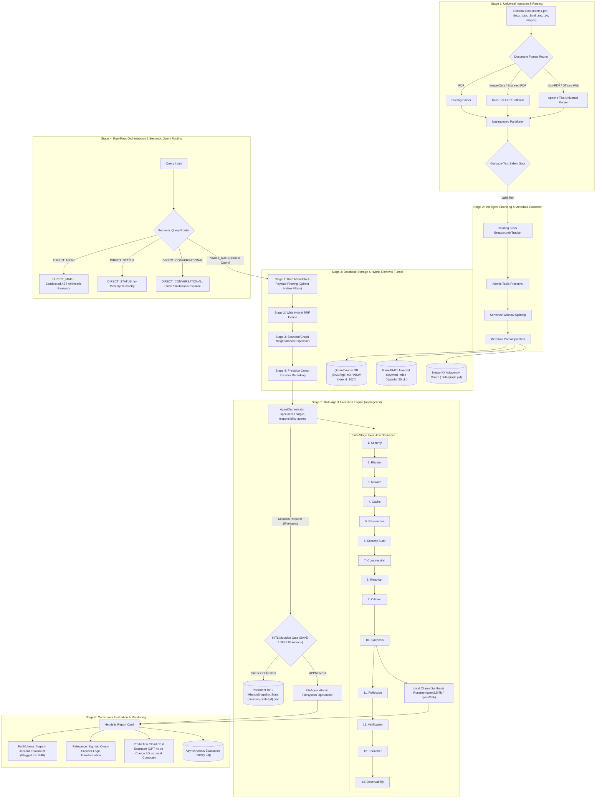
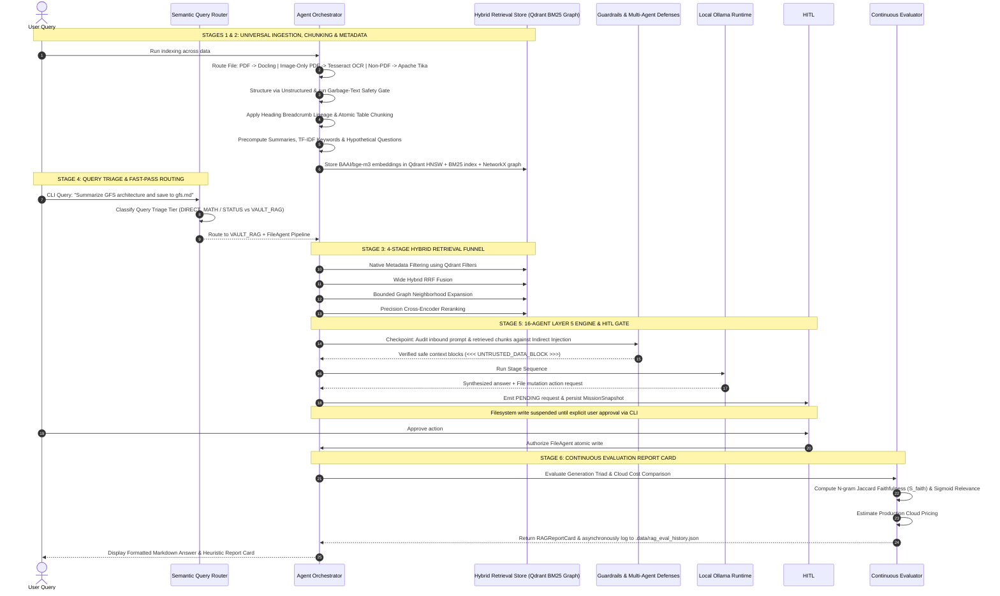

# End-to-End Architecture & Execution Flow

> *A complete architectural walkthrough covering document ingestion, intelligent processing, hybrid retrieval, query routing, agent orchestration, human-in-the-loop approvals, and continuous evaluation.*

## System Architecture Flowchart

This flowchart maps all six core architectural stages of **benzyl-RAG** and illustrates data flow from raw external documents to synthesized grounded responses and evaluation report cards.

## Sequence Diagram

This sequence diagram depicts the execution lifecycle across the stages for a domain query and file mutation request

